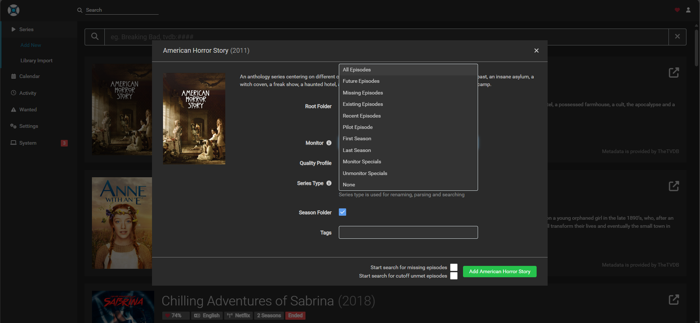

# Sekilas Tentang
**Sonar** adalah sebuah *Private Video Recorder* (PVR) untuk konten-konten video dan acara TV yang gratis dan *open source*. Sonarr mampu memonitor RSS Feeds untuk acara-acara TV yang baru saja rilis, dan mampu melakukan pengunduhan, *sorting*, dan modifikasi secara otomatis. Selain itu, Sonarr juga dapat dikonfigurasi untuk melakukan *upgrade* secara otomatis terhadap kualitas *files* yang diunduh apabila kualitas terbaru sudah tersedia 

# Instalasi

#### Kebutuhan Sistem

- Unix, Linux atau Windows
- .NET Core (Linux atau MacOS)
- Mono (Linux/MacOS) untuk menjalankan program dengan framework .NET
- RAM dengan kapasitas minimial 1 GB
- Penyimpanan memori dengan kapasitas minimal 1 GB
- Cloudflared agar website bisa diakses secara publik
- Visual Studio Code

#### Proses Instalasi:

1. Pastikan seluruh sistem kita *up-to-date*, dan install seluruh kebutuhan sistem yang diperlukan, seperi `dotnet `, `mono`, dan `cloudflared`  
   ```
   sudo apt update
   sudo apt upgrade
   sudo apt install mono-complete
   sudo apt-get install -y dotnet-sdk-6.0
   ```

2. Unduh **Sonarr** ke dalam direktori kita
   ```
   wget "https://services.sonarr.tv/v1/download/main/latest?version=4&os=linux&arch=x64" -O sonarr.tar.gz
   ```

3. Ekstrak file yang telah diunduh ke dalam direktori yang kita inginkan, disini saya langsung mengekstrak file di direktori home/username 
   ```
   tar -xvzf sonarr.tar.gz
   ```

5. Unduh package `cloudflared` sesuai dengan jenis Linux yang anda gunakan. Karena saya menggunakan Kali Linux, maka saya menggunakan Cloudflared dengan versi `amd64`
   ```
   wget https://path-to-cloudflared/cloudflared-linux-amd64.deb
   ```

6. Install package `cloudflared` 
   ```
   wget https://path-to-cloudflared/cloudflared-linux-amd64.deb
   ```

7. Pastikan package `Cloudflared` berada pada direktori yang sama dengan `Sonarr`
   ```
   mv cloudflared-linux-amd64.deb ~/Sonarr/
   ```

8. Buka code editor yang anda gunakan dan jalankan kode berikut. Ganti alamat localhost sesuai dengan komputer yang anda gunakan
   ```
   cloudflared tunnel -url http://localhost:8989
   ```

9. Apabila `Cloudflared` berhasil dijalankan, maka akan mengembalikan output sebaagi berikut. Klik link untuk mengakses Sonarr dan bagikan link tersebut agar bisa dibagikan kepada orang lain.
   ```
   2024-10-12T02:49:42Z INF +--------------------------------------------------------------------------------------------+
   2024-10-12T02:49:42Z INF |  Your quick Tunnel has been created! Visit it at (it may take some time to be reachable):  |
   2024-10-12T02:49:42Z INF |  https://campaign-ins-solutions-pierre.trycloudflare.com                                   |
   2024-10-12T02:49:42Z INF +--------------------------------------------------------------------------------------------+
   ```

# Cara Pemakaian
A. Konfigurasi Awal
1. Atur Path Penyimpanan
   - Pergi ke menu **Settings** > **Media Management** > **Root Folders**
   - Tambahkan direktori untuk menyimpan unduhan acara TV

2. Tambahkan Indexer
   - Pergi ke **Settings** > **Indexers**
   - Klik tombol **Add Indexer** dan pilih salah satu layanan penyedia torrent atau NZB (misalnya, Rarbg, Jackett, atau Omgwtfnzbs)
   - Masukkan API Key dan informasi lainnya sesuai kebutuhan

3. Tambahkan Downloader
   - Pergi ke **Settings** > **Download Client**
   - Klik **Add Client** dan pilih aplikasi downloader digunakan, seperti **qBittorrent**, **Transmission**, atau **NZBGet**
   - Masukkan detail yang diperlukan, seperti host, port, username, dan password downloader

4. Atur Kualitas
   - Pergi ke **Settings** > **Quality** dan sesuaikan format dan ukuran file yang ingin diunduh (misalnya, 1080p, 720p, atau SD)

  
B. Menambahkan Acara TV
1. Cari dan Tambahkan Acara TV
   - Klik tombol **Series** di menu utama
   - Pilih **Add Series**, lalu masukkan nama acara TV yang ingin dipantau
   - Sonarr akan mencari informasi acara TV tersebut dari berbagai sumber (seperti **TVDB** atau **TMDB**)

2. Atur Path
   - Saat menambahkan acara TV, pilih direktori tempat Sonarr akan menyimpan file unduhan

3. Konfigurasi Monitoring
   - Pilih episode atau musim yang ingin kamu pantau, apakah semua episode, episode tertentu, atau hanya episode terbaru


# Pembahasan
***Sonarr*** adalah aplikasi PVR open-source yang dirancang untuk mengelola dan mengotomatisasi unduhan acara TV. Dengan Sonarr, pengguna dapat menambahkan serial TV ke dalam perpustakaan mereka, dan aplikasi ini secara otomatis akan mencari dan mengunduh episode baru dari berbagai sumber, termasuk torrent dan Usenet.

- **Bahasa Pemrograman**: Sonarr dibangun menggunakan bahasa pemrograman C# dan menggunakan framework .NET. Ini memungkinkan aplikasi berjalan di berbagai sistem operasi, termasuk Windows, macOS, dan Linux.
- **Database**: Sonarr menggunakan SQLite sebagai database untuk menyimpan informasi mengenai acara TV, episode, dan pengaturan pengguna.
- **Antarmuka Pengguna**: Sonarr memiliki antarmuka pengguna berbasis web yang memudahkan pengguna untuk menavigasi dan mengelola koleksi acara TV mereka.

Sonarr dirancang dengan fungsionalitas dan ciri khas tertentu yang membedakannya dari sistem manajemen konten (CMS) lainnya. Aplikasi ini memiliki keunggulan yang unik, yang menjadikannya pilihan yang menarik bagi penggunanya:

1. **Automasi Unduhan**: Sonarr secara otomatis mencari dan mengunduh episode baru, mengurangi pekerjaan manual bagi pengguna.
2. **Integrasi dengan Klien Unduhan**: Sonarr dapat terintegrasi dengan berbagai klien torrent dan Usenet, seperti qBittorrent, NZBGet, dan Deluge, untuk mengelola unduhan.
3. **Pengaturan Notifikasi**: Pengguna dapat mengatur notifikasi untuk memberi tahu mereka saat episode baru tersedia atau ketika unduhan selesai.
4. **Manajemen Metadata**: Sonarr memungkinkan pengguna untuk mengelola metadata acara TV, termasuk informasi detail tentang episode dan gambar.
Dukungan Komunitas: Sebagai proyek open-source, Sonarr didukung oleh komunitas yang aktif, menyediakan pembaruan, bug fix, dan fitur baru secara berkala. 

Meskipun Sonarr menawarkan banyak manfaat, keberadaannya tidak menjadikannya sempurna. Ada beberapa kekurangan yang dimiliki oleh Sonarr, antara lain:

1. **Ketergantungan pada Sumber Eksternal**: Sonarr memerlukan koneksi yang stabil ke sumber eksternal (torrent/Usenet) untuk berfungsi, yang dapat menjadi masalah jika sumber tersebut tidak dapat diakses.
2. **Keterbatasan dalam Pengelolaan Film**: Sonarr khusus untuk acara TV; pengguna yang juga ingin mengelola film harus menggunakan aplikasi lain seperti Radarr.
3. **Kompleksitas Awal**: Bagi pengguna baru, konfigurasi awal dan pengaturan integrasi dengan klien unduhan bisa sedikit membingungkan.
4. **Isu Legalitas**: Tergantung pada penggunaan sumber unduhan, ada isu legal yang mungkin dihadapi pengguna terkait dengan hak cipta.

Ketika dibandingkan dengan CMS lain yang menawarkan layanan serupa dari penerbit yang sama, Sonarr memiliki kelebihan dan kekurangan yang unik. Berikut adalah perbandingan antara Sonarr dan Radarr.


  -  Fokus Utama Pengembangan :
      - Sonarr: Dikhususkan untuk acara TV, memberikan fitur pengelolaan yang lebih mendalam untuk serial.
      - Radarr: Dikhususkan untuk film, dengan fungsionalitas serupa dalam hal pengunduhan otomatis.  
  -  Pengelolaan Metadata :
     - Sonarr: Menyediakan informasi rinci tentang setiap episode dan sinopsis.
     - Radarr: Memfokuskan pada informasi film, termasuk poster, trailer, dan sinopsis film
  -  Integrasi dengan Klien Unduhan :
     - Keduanya (Sonarr dan Radarr) mendukung integrasi dengan klien unduhan yang sama, tetapi masing-masing dioptimalkan untuk jenis media yang berbeda. 
  -  Fitur Otomatisasi : 
     - Sonarr menonjol dengan fitur otomatisasi pencarian dan pengunduhan untuk acara TV.
     - Radarr memiliki fitur serupa untuk film, tetapi dengan pengaturan yang mungkin berbeda. 

# Kesimpulan 
**Sonarr** adalah aplikasi web open-source yang sangat berguna sebagai PVR untuk mengelola unduhan acara TV secara otomatis. Dengan kemampuan memantau RSS Feeds dan mengunduh episode terbaru secara otomatis, Sonarr sangat cocok bagi pengguna yang ingin menghemat waktu dalam mencari dan mengelola konten. Kelebihannya antara lain automasi unduhan, integrasi dengan berbagai klien torrent dan Usenet, serta antarmuka web yang memudahkan pengelolaan koleksi acara TV. Selain itu, fitur pengaturan notifikasi dan manajemen metadata menambah nilai tambah aplikasi ini. Namun, kekurangannya meliputi ketergantungan pada sumber eksternal untuk unduhan dan kompleksitas instalasi awal, terutama bagi pengguna baru.

Dibandingkan dengan aplikasi sejenis seperti Radarr, Sonarr lebih fokus pada acara TV, sementara Radarr ditujukan untuk pengelolaan film. Kedua aplikasi ini menawarkan fitur serupa dalam hal otomatisasi, integrasi dengan klien unduhan, dan pengelolaan metadata, tetapi Sonarr lebih dioptimalkan untuk serial TV. Meskipun memiliki kekurangan seperti keterbatasan pengelolaan film dan potensi masalah legalitas terkait hak cipta, Sonarr tetap menjadi pilihan yang unggul untuk pengguna yang ingin mengelola koleksi acara TV mereka secara efisien.

# Referensi
1. [Official SonarrTV Website](https://sonarr.tv) - Official Website SonarrTV
2. [Official Radarr Website](https://radarr.video) - Official Website Radarr
3. [Radarr Servarr Wiki](https://wiki.servarr.com/en/radarr) - Sonarr Wiki
4. [Sonarr Servarr Wiki](https://wiki.servarr.com/en/sonarr) - Radarr Wiki
